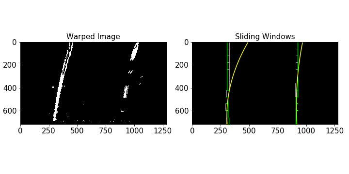
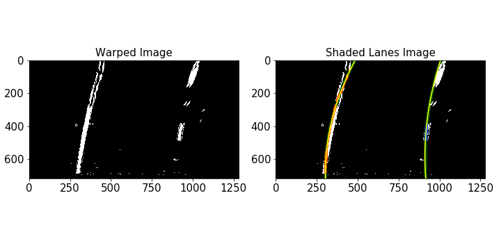

## Advanced Lane Finding
[](http://www.udacity.com/drive)

In this project, the goal is to write a software pipeline to identify the lane boundaries in a video.

<<<<<<< HEAD
To view the output of the notebook, you can use this [link](Advanced-Lane-Lines.html)
=======
To view the output of the notebook, you can use this [link](Advanced-Lane-Lines.pdf)
>>>>>>> 82b45168e2d06d0725ba324a041b1fa9b72c4483


---

**The goals / steps of this project are the following:**

* Compute the camera calibration matrix and distortion coefficients given a set of chessboard images.
* Apply a distortion correction to raw images.
* Use color transforms, gradients, etc., to create a thresholded binary image.
* Apply a perspective transform to rectify binary image ("birds-eye view").
* Detect lane pixels and fit to find the lane boundary.
* Determine the curvature of the lane and vehicle position with respect to center.
* Warp the detected lane boundaries back onto the original image.
* Output visual display of the lane boundaries and numerical estimation of lane curvature and vehicle position.

---

### Writeup / README

#### 1. Provide a Writeup / README that includes all the rubric points and how you addressed each one.  You can submit your writeup as markdown or pdf.  [Here](https://github.com/udacity/CarND-Advanced-Lane-Lines/blob/master/writeup_template.md) is a template writeup for this project you can use as a guide and a starting point.  

You're reading it!

### Camera Calibration

#### 1. Briefly state how you computed the camera matrix and distortion coefficients. Provide an example of a distortion corrected calibration image.

The code for this step is contained in the IPython notebook located in "Advanced-Lane-Lines.ipynb" .  

I start by preparing "object points", which will be the (x, y, z) coordinates of the chessboard corners in the world. Here I am assuming the chessboard is fixed on the (x, y) plane at z=0, such that the object points are the same for each calibration image.  Thus, `objp` is just a replicated array of coordinates, and `objpoints` will be appended with a copy of it every time I successfully detect all chessboard corners in a test image.  `imgpoints` will be appended with the (x, y) pixel position of each of the corners in the image plane with each successful chessboard detection.  

I then used the output `objpoints` and `imgpoints` to compute the camera calibration and distortion coefficients using the `cv2.calibrateCamera()` function.  I applied this distortion correction to the test image using the `cv2.undistort()` function and obtained this result: 


### Pipeline (single images)

#### 1. Provide an example of a distortion-corrected image.

Before the distortion-correction step, I use `region_of_interest` function built in previous project, to extract the road region with lanes that we are interested. 
The key to extract a good region is to find a best trapezoid which contains both lanes and exclude all the other noise on the road.

The vertices I chose:

```python
vertices = np.array([[(150, imshape[0]), 
						(570, 430), 
						(700, 430),
                     (imshape[1]-80, imshape[0])]], 
						dtype=np.int32)
```


The result example is shown below:


Then, use `undistort()` function to undistort this region.
To demonstrate this step, I will describe how I apply the distortion correction to one of the test images like this one:


#### 2. Describe how (and identify where in your code) you used color transforms, gradients or other methods to create a thresholded binary image.  Provide an example of a binary image result.

I used a combination of color and gradient thresholds to generate a binary image (thresholding steps at `threshold_binary()` function in `Advanced-Lane-Lines.ipynb`). In order to detect different color of lane lines under caring degrees of daylight and shadow, I combined x gradient threshold and S channel, where the threshold of x gradient is `sx_thresh=(80, 110)` and threshold of S channel is `s_thresh=(100, 255)`.


Here's an example of my output for this step:


#### 3. Describe how (and identify where in your code) you performed a perspective transform and provide an example of a transformed image.

The code for my perspective transform includes a function called `perspective_transform()`.  The `perspective_transform()` function takes as inputs a binary image (`img`), as well as source (`src`) and destination (`dst`) points.  I chose the hardcode the source and destination points in the following manner:

```python
src = np.float32(
    [[(img_size[0] / 2) - 55, img_size[1] / 2 + 100],
    [((img_size[0] / 6) - 10), img_size[1]],
    [(img_size[0] * 5 / 6) + 60, img_size[1]],
    [(img_size[0] / 2 + 55), img_size[1] / 2 + 100]])
dst = np.float32(
    [[(img_size[0] / 4), 0],
    [(img_size[0] / 4), img_size[1]],
    [(img_size[0] * 3 / 4), img_size[1]],
    [(img_size[0] * 3 / 4), 0]])
```

This resulted in the following source and destination points:

| Source        | Destination   | 
|:-------------:|:-------------:| 
| 585, 460      | 320, 0        | 
| 203, 720      | 320, 720      |
| 1127, 720     | 960, 720      |
| 695, 460      | 960, 0        |

I verified that my perspective transform was working as expected by drawing the `src` and `dst` points onto a test image and its warped counterpart to verify that the lines appear parallel in the warped image.


#### 4. Describe how (and identify where in your code) you identified lane-line pixels and fit their positions with a polynomial?

The code to identify lane-line pixels and fit the positions with a polynomial can be funded in `find_lane_pixels()`. To track lane positions in the video, I also used `Line()` class and set `LEFT`, `RIGHT` corresponding to the left lane information and right lane information.

First, I need to find the lane pixels by using the sliding windows. The hyper parameters of the window is: `nwindows = 9`, `margin = 50`, `minpix = 1`. We iterate through the windows to track the lanes curvature and store the activated pixels in the left lane and right lane list.

Then, we use the left and right line pixel positions to fit a polynomial to the line. There are some important result we need to use to update current lanes information for the video.

Here is the visualization of the sliding windows:



I also tried draw the lane shadow to skip the windows step once I found the lines. The result is shown below:




#### 5. Describe how (and identify where in your code) you calculated the radius of curvature of the lane and the position of the vehicle with respect to center.

I did this in `measure_curvature_and_offset()`.
To find the position of the vehicle with respect to the center, first, I calculated the midpoint (pixel) between left and right lanes and compared it to the midpoint of the camera (center of the image, pixel). Then, I converted the comparison result from pixels to meters and got the distance from the center of the lane. 

To calculate the radius of curvature of the lane, I used the lanes information we got from previous step and also converted it from pixels to meters. At the same time, use `Line()` class to update the `Line.line_base_pos` and `Line.radius_of_curvature`. 

The result for `test2.jpg` is:

```
Offset from center is 1.1809495135856067 m
Radius of curvature is 786.9896433736152 m
```


#### 6. Provide an example image of your result plotted back down onto the road such that the lane area is identified clearly.

I implemented this step in the function `drawing()`.  Here is an example of my result on a test image:


---

### Pipeline (video)

#### 1. Provide a link to your final video output.  Your pipeline should perform reasonably well on the entire project video (wobbly lines are ok but no catastrophic failures that would cause the car to drive off the road!).

Here's a [link to my video result](video_output/project_video_output.mp4)

Here's a [link to challenge video result](video_output/project_video_output.mp4)


---

### Discussion

#### 1. Briefly discuss any problems / issues you faced in your implementation of this project.  Where will your pipeline likely fail?  What could you do to make it more robust?

When I wrote up the project, I realized that it is much better if I wrapped the code in python script file. If I have time, I will create the script file for all the functions and display them in the notebook.

The output video shows that the pipeline works well on the clear road with small curvature of lanes. But the challenge video shows that the extracted region from `region_of_interest()` is not good enough to cover the 90 degree curvature, and it is easy to be affected by other vehicles. And the the thresholds for `threshold_binary()` doesn’t work well on some shadow road images or light road images. 

To make it more robust, I may need to modify vertices for different situation on the road. For example, if the road is with small curvature of lanes, we can use simple trapezoid as we used in this project, else if the curvature is large, we may need to enlarge the trapezoid. And also, I need to set up a threshold for the width between two lanes to prevent the interference from other vehicles or other edge lanes. For example, if the width suddenly increases and exceed the threshold, which means it meets some interference, it will keep previous width to keep the right detection.

To prevent the light or shadow interference, I need to combine more thresholds such as gradient magnitude threshold and direction threshold.
 


